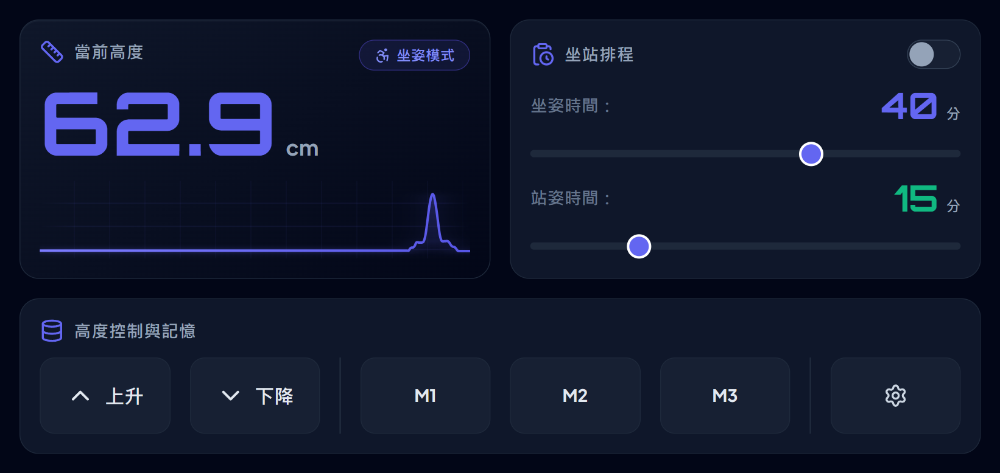
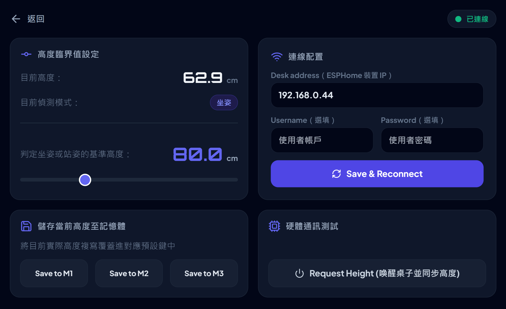

# SmartDesk - 智慧升降桌觸控儀表板

這是一個專為手機與平板橫置（Landscape）操作的智慧升降桌觸控主控台。透過與智慧升降桌節點（基於 ESPHome）連線，提供即時高度監控、手動升降、坐站排程管理與記憶鍵設定。

## 硬體與元件搭配需求

本儀表板無法獨立運作，必須搭配 [custom-esphome-components](https://github.com/gene891212/custom-esphome-components) 專案中的 `desky` 元件的 ESP 晶片（如 ESP32/ESP8266）節點。

ESPHome 節點負責透過實體線路（如 UART）連接升降桌控制盒並讀寫數據，同時啟用 Web Server 與 EventSource (SSE) 服務以供本儀表板進行雙向通訊。

## ESPHome 實體對照表

本控制台透過 EventSource (SSE) 與 REST API 直接與 ESPHome 裝置進行雙向通訊。請確保您的 ESPHome 節點設定檔中，所輸出的實體識別碼（Entity ID）與以下對照表相符：

| 功能說明 | ESPHome 實體 ID (Entity ID) | API 識別碼 / DOM ID |
| :--- | :--- | :--- |
| **當前高度** | `sensor.desk_height` | `sensor-desk_height` |
| **姿勢狀態** | `binary_sensor.is_sitting` | `binary_sensor-is_sitting` |
| **排程開關** | `switch.work` | `switch-work` |
| **坐姿時間限制** | `number.sitting_time` | `number-sitting_time` |
| **站姿時間限制** | `number.standing_time` | `number-standing_time` |
| **坐站臨界高度** | `number.stand_and_sit_height_threshold` | `number-stand_and_sit_height_threshold` |
| **記憶預設高度 1~3** | `button.m1`, `2`, `3` | `button-m1` ~ `3` |
| **儲存目前高度 1~3** | `button.save_height_in_memory_1` ~ `3` | `button-save_height_in_memory_1` ~ `3` |
| **高度回報請求** | `button.request_desk_height` | `button-request_desk_height` |

## 快速開始

1. 打開網頁後，點擊右下角的設定按鈕（齒輪圖示）。
2. 在連線配置欄位輸入您智慧升降桌的 ESPHome 裝置 IP 位址（如 `192.168.1.120`）。
3. 若您的裝置有啟用安全驗證，請輸入對應的 Username 與 Password。
4. 點擊 Save & Reconnect，右上角狀態燈顯示「已連線」即完成配置。

## 檔案結構說明

* `index.html`：核心 UI 架構，專為橫置觸控設計的網格版面。
* `style.css`：圖表發光特效、字體與背景漸層定義。
* `app.js`：包含 Catmull-Rom 曲線計算、SSE 事件串接與狀態同步的核心邏輯。
* `sw.js`：Service Worker 快取配置，實現離線使用。
* `manifest.json`：PWA 全螢幕（Fullscreen）啟動資訊配置。
